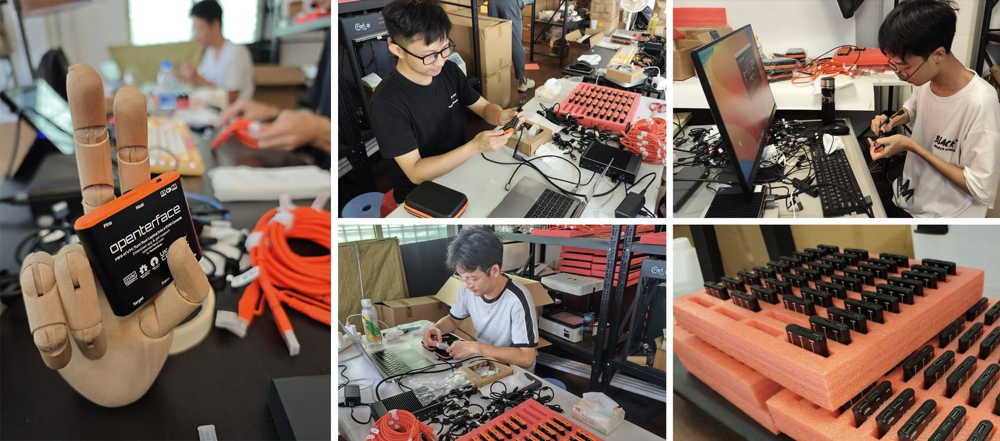
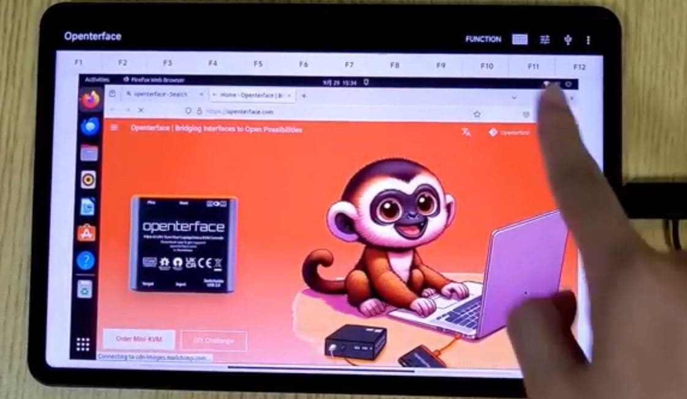

# Exciting Times Ahead: Innovation, Community, and a Dash of Fun!

Hey there, Openterface enthusiasts!

We've got some exciting news to share! From a thrilling new DIY challenge to production milestones and cool software updates—things are buzzing here at Openterface. Grab a drink, make yourself comfy, and dive into this update with us!

## **USB KVM DIY Challenge 2024: Time to Unleash Your Inner Tech Wizard!**

Attention all tinkerers, makers, and dreamers! We're thrilled to present the **USB KVM DIY Challenge 2024**, a collaboration with **TechxArtisan, Make: Magazine, the Open Source Hardware Association (OSHWA)**, and **Crowd Supply**. This is your chance to create a custom KVM solution—let’s see what magic you can whip up with your Openterface Mini-KVM!

Here’s the rundown:

- **Mission**: Create your very own open KVM solution using the Openterface Mini-KVM, with your personal twist to meet your specific needs.
  
- **Categories**: Prizes for top performers include awards for both technical skill and creativity—so everyone has a shot!

- **Awesome Prizes**: 
    - A limited-edition **Openterface Mini-KVM** with a transparent and silver case.
    - The futuristic **Pi-Cast KVM** by HackerGadgets.
    - The retro-inspired **GameShell** by Clockwork.

- **Timeline**: The challenge kicks off on **October 1, 2024**, and submissions close on **February 28, 2025**.

- **Judges**: Experts from **TechxArtisan, Make: Magazine, OSHWA**, and **Crowd Supply** will evaluate your projects.

Whether you're a seasoned tech wizard or just stepping into the world of hardware hacking, this contest is your playground. Who knows? You might create the next big thing in tech! 

Join the action on [Crowd Supply's official contest page](https://www.crowdsupply.com/techxartisan/usb-kvm-diy-challenge-2024) and chat with us on the [contest Discord channel](https://discord.gg/YhKVzDujkT). **Let the innovation games begin!**

*Openterface Mini-KVM available in three cool enclosures—transparent, silver, and black*

*Some of the awesome prizes: Pi-Cast KVM by HackerGadgets and GameShell by Clockwork*

## **Production Update: Almost There!**

Here’s a sneak peek at the hard work going on behind the scenes—our studio has been buzzing like a beehive! So far, we’ve assembled **800 units** of the Openterface Mini-KVM.

Our quality control is **top-notch**. Every unit is checked, rechecked, and pampered by our team to ensure that when it arrives in your hands, it’s not just good—it’s great! We aim for the kind of quality that makes other devices green with envy.

We know waiting can be hard, but we’re committed to delivering the best experience possible. Thank you for your patience as we put on the final touches!

## **Software Update: Android App Gets a Nice Upgrade**

Our Android app just received a major upgrade. Now controlling your target devices through your phone or tablet has never been easier or more fun!

Check out the demo video here: [Android App Demo Video](https://x.com/TechxArtisan/status/1840587612148699398)

Here’s what’s new:

- **Smooth and responsive** touch controls
- **Easy drag-and-drop** functionality
- **Precise tapping** for an intuitive experience
- A new **function key bar** for added convenience
- **Upcoming feature**: customizable keyboard shortcuts
- Compatible with both **Android tablets and phones**

This app makes the Openterface Mini-KVM even more useful for tech pros on the go. We’ve also uploaded the latest APK and source code to our [GitHub repo](https://github.com/TechxArtisanStudio/Openterface_Android) if you want to explore further or contribute!

## **Wrapping It Up**

Phew! That was quite the update, right?

If you have any ideas, feedback, or wild KVM dreams, we want to hear them! Slide into our DMs, send a carrier pigeon 🕊️, or hop onto one of [our community channels](https://openterface.com/community/). We love connecting with you!

Thanks again for your patience and for being the best tech community out there. We’ve got more exciting news and updates coming soon—stay tuned!

With gratitude,  
Billy Wang  
Product Manager  
Openterface Team | TechxArtisan  