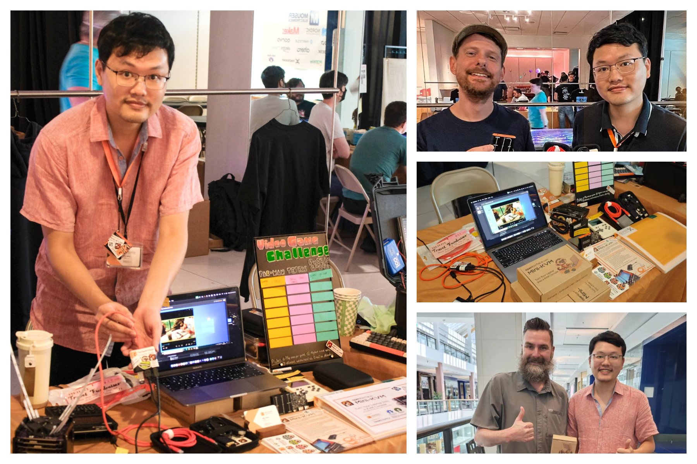
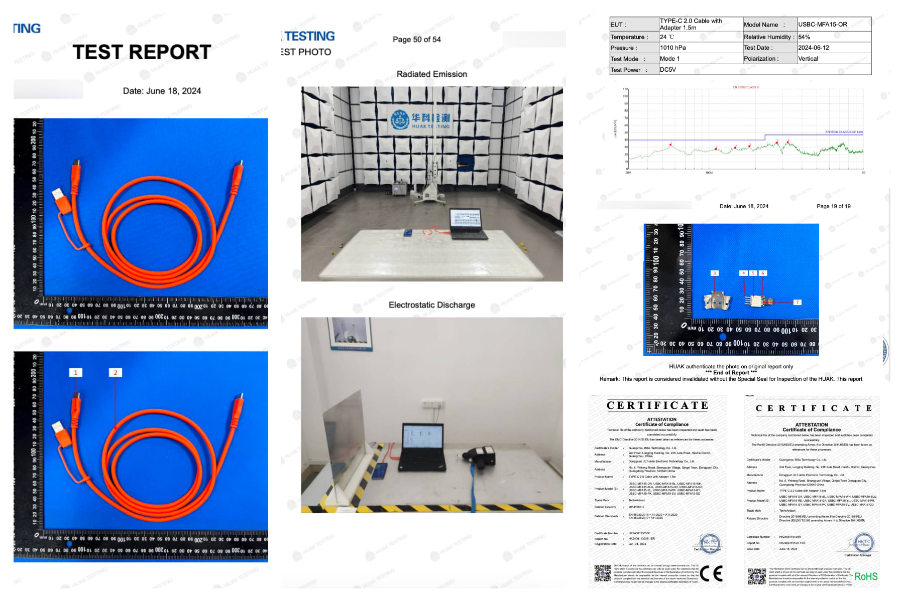
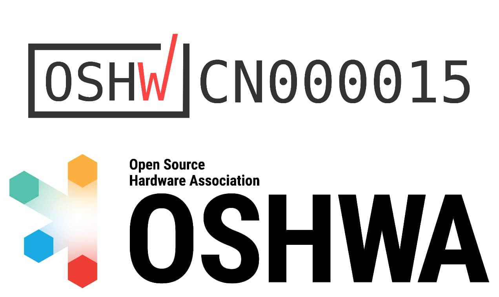

# From Teardown to Production: We’re Moving Forward!

Hey everyone,

It’s been a while since our crowdfunding campaign ended, and we’ve got some fantastic updates to share with you. We’re excited to dive headfirst into the production phase of our Openterface Mini-KVM and keep you informed on our progress.

## Teardown 2024 Highlights

First of all, last month’s [Teardown 2024](https://x.com/TechxArtisan/status/1810619822948090092) hosted by **Crowd Supply** in Portland was nothing short of amazing. It was fantastic to meet so many of our tech friends and backers in person at our demo table! Your kind words are a great encouragement and motivation for us. Here are some snaps from the event:

A big shoutout to Electromaker for featuring our product during the event! Check out our chat in this video:
<iframe width="560" height="315" src="https://www.youtube.com/embed/K0EuMSQEwKo?si=HWoTs9XQ4f57hT7c" title="YouTube video player" frameborder="0" allow="accelerometer; autoplay; clipboard-write; encrypted-media; gyroscope; picture-in-picture; web-share" referrerpolicy="strict-origin-when-cross-origin" allowfullscreen></iframe>

## Production in Full Swing

Right now, we're busily placing **orders for various parts and chips** like the CH9329 and CH340 as we prepare for production. We’re also submitting our Mini-KVM and various cables to a certified lab for CE, RoHS, and UKCA certification testing. If everything goes smoothly, we’ll be ready to kick off production at the factories soon. Our team is making sure every step of the production line is as smooth as possible, so we can deliver a top-notch product that’s both fun and reliable! Here are some snaps of the test reports for RoHS and CE for our orange Type-C cable: 

## OSHWA Certification
We’re thrilled to announce that our Openterface Mini-KVM is now officially **OSHWA** certified as fully open-source! 🥳 You can check out our certification here: [OSHWA UID CN000015](https://certification.oshwa.org/cn000015.html)

## Hardware Update V1.9
We’ve just launched our **hardware V1.9 with extra pins** for even more hackable fun and potential! Think ATX, network bridging, audio bypass, and more. What creative ideas do you have for hacking our Mini-KVM with these pins? Join our [Reddit](https://www.reddit.com/r/Openterface_miniKVM/) or [Discord](https://discord.gg/sFTJD6a3R8) and share your thoughts with us!

<blockquote class="reddit-embed-bq" style="height:500px" data-embed-height="679"><a href="https://www.reddit.com/r/Openterface_miniKVM/comments/1e25pco/openterface_minikvm_v19_with_pins_for_more/">Openterface MiniKVM V1.9 with pins for more hackable fun! Think ATX, network bridging, audio bypass, etc. Thoughts?</a>  by<a href="https://www.reddit.com/user/youyoubilly/">u/youyoubilly</a> in<a href="https://www.reddit.com/r/Openterface_miniKVM/">Openterface_miniKVM</a></blockquote>

## QT Host App on Pi
We’ve successfully **run our QT host app on a Pi environment**! What’s even more exciting is how our Mini-KVM can team up with Clockwork’s **uConsole** to turn it into a portable KVM tool. It’s super handy for plug-and-play and quick troubleshooting of any headless devices nearby.
<blockquote class="twitter-tweet" data-media-max-width="560">
Here&#39;s a quick demo video of our Qt host app running on the Pi within this uConsole. <a href="https://t.co/xwrOE9pCcF">pic.twitter.com/xwrOE9pCcF</a>
&mdash; TechxArtisan (@TechxArtisan) <a href="https://twitter.com/TechxArtisan/status/1807824199152722019?ref_src=twsrc%5Etfw">July 1, 2024</a></blockquote> 

## Development & Final Touches
Our dev team, led by Kevin, is working tirelessly to test and refine the code. Join our [Techxartisan's Discord](https://discord.gg/sFTJD6a3R8) to hang out with our dev and beta team and stay updated on our progress. Billy is handling all the paperwork and finalising the design for our product, packaging, and product manual. Here’s a sneak peek of our updated version of prints and labels for the aluminium case. Check out this Kazubu's when Billy showed it off to him in Tokyo, Japan:
<blockquote class="twitter-tweet">
突如(トランジットで)来日したOpenterface Mini-KVMの製造元のFounderと新宿で飲んでるなう 新たなデザインを見せてもらった <a href="https://t.co/Um8wkpqeds">pic.twitter.com/Um8wkpqeds</a>
&mdash; Kazubu (@_kazubu) <a href="https://twitter.com/_kazubu/status/1803442407800971612?ref_src=twsrc%5Etfw">June 19, 2024</a></blockquote> 

## On Track for September
We’re currently on track and working hard to get our Mini-KVMs into your hands by the end of September.

Thank you all for your continued support and enthusiasm. We couldn't have done it without you!

Cheers,  
Billy Wang
Openterface Team
